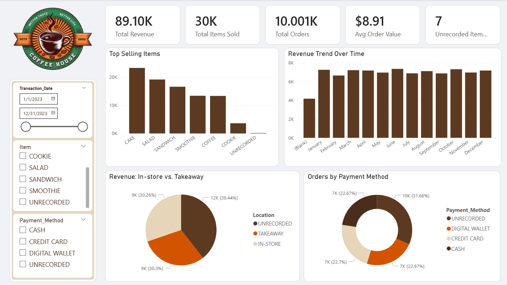
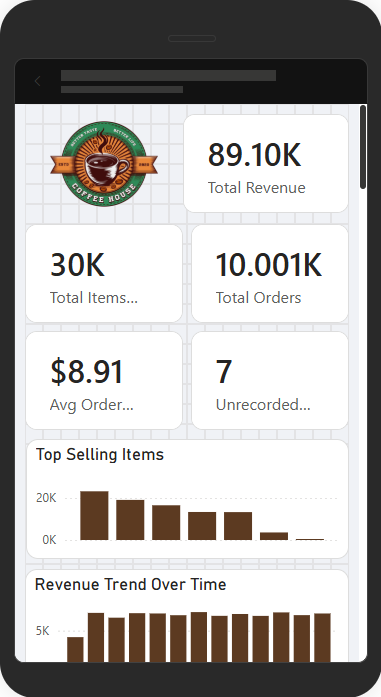

# ☕ [Cafe House: Operations & Sales Data Recovery Audit]

## 📌 Project Overview
**Goal:** Recover missing financial data from a corrupted POS dataset and visualize sales performance.
**Role:** Data Analyst.
**Tools:** SQL (MySQL), Power BI, Excel.

### 💾 Data Source
The dataset used for this project is the **Cafe Sales Dirty Dataset**, which contained missing values and error strings.
* **Dataset Link:** [Cafe Sales Dataset - Kaggle](https://www.kaggle.com/datasets/rohitsahoo/cafe-sales-dirty-dataset)

---

## 💼 The Business Problem
The "Cafe House" records were corrupted, with many transactions missing the total amount or item names. Simply deleting these rows would lead to inaccurate revenue reporting. The goal was to use the available data to "fill in the blanks" mathematically.

**Key Questions:**
1. How can we accurately report total revenue when 60% of the raw data contains missing or corrupted financial fields?
2. Can we statistically identify 'null' products based on their price points to recover categorical insights?
3. What is the final validated revenue after performing mathematical data recovery?

---

## 🛠️ Technical Approach

### 1. Data Engineering (SQL)
- **Mathematical Recovery:** Calculated missing values using the formula: `Total_Spent = Price_Per_Unit * Quantity`.
- **Logic-Based Imputation:** Assigned the name 'SANDWICH' to missing items that had a price of $4.00, based on frequency analysis.
- **Data Cleaning:** Replaced 'ERROR' and 'UNKNOWN' strings with proper `NULL` values to prepare for Power BI.

### 2. Visualization (Power BI)
Built an interactive dashboard to display the recovered data.
- **Power Query:** Used the "Replace Values" feature to change `null` entries in `Item`, `Location`, and `Payment_Method` to `UNRECORDED`.
- **DAX Measure:** Created one specific measure to track data quality:
  - `Unrecorded Items = CALCULATE(COUNTROWS(cafe_data_clean), cafe_data_clean[Item] = "UNRECORDED")`

---

## 📊 Key Insights (The Story)
1. **Financial Recovery:** Validated a total revenue of **$89.10K** after recovering missing transaction values.
2. **Product Performance:** **Cakes** and **Salads** were identified as the top revenue generators.
3. **Audit Transparency:** Only **7 items** remained completely unrecorded out of 10,000, achieving a **99.93% recovery success rate**.

---

## 📷 Project Visuals

### 🖥️ Desktop Dashboard

### 📱 Mobile Layout

---

## 📂 Files Included
- `Data/dirty_cafe_sales.csv`: The dirty data.
- `cafe_data_clean.csv`: The clean data.
- `SQL/Cafe_Sales_Data_Cleaning.sql`: The full SQL script for data imputation.
- `Dashboard/Cafe_Dashboard.pbix`: Final Power BI source file.
- `README.md`: Project documentation and process breakdown.
